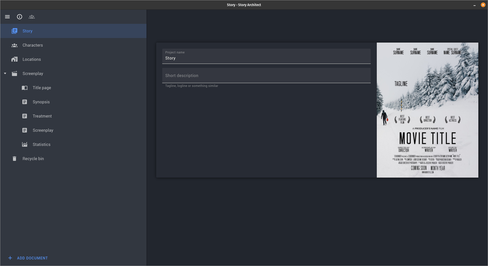

# Story Architect is writer's best friend

  

  

# Welcome to Story Architect

  

Hello and welcome to **Starc's** GitHub page. Story Architect is a project created by the authors of an open source screenwriting tool [**Kit Scenarist**](https://github.com/dimkanovikov/KITScenarist) and is currently under development with its current release being alpha. It's an advanced text editor for script writers working professionally in film, theatre, radio or writing for comic books.
  

## Installation

  

**Starc** is available for Windows, Mac and Linux. You can download it from [**starc.app**](https://starc.app/download) website.

  

## Supported formats

  

Starc has its own *.starc* file format, but also allows you to import files using Final Draft's *.fdx* format as well as *.docx*, *.odt*, *.trelby*, *.celtx* & *Fountain*, as well as the ability to import projects from **Kit Scenarist**.

  

>  **Note:** Currently, importing projects from KIT Scenarist only allows importing the script. Importing other data, such as text documents and images will be supported in future releases.

## Language support

**Starc** currently supports following languages:

- Azerbaijani
- Croatian
- Galician
- German (de)
- Portuguese (Brazil)
- Romanian (Romania)
- Russian (ru) 
- Spanish (es) 
- Ukrainian (uk) 
- French (fr) 
- Hebrew (he) 
- Slovenian (sl) 
- Belarusian (be) 
- Hungarian (hu) 
- Turkish (tr) 
- Catalan (ca) 
- Hindi (hi) 
- Polish (pl) 
- Italian (it) 
- Danish (Denmark) 
- Tagalog (Philippines) 
- Portuguese (Portugal) 
- Persian (fa) 
- Indonesian (id) 
- Esperanto (eo) 
- Arabic (ar) 
- Dutch (nl) 
- Filipino (Philippines) 
- Tamil (ta)
- Telugu (te) 

If you wish to add another language, please consult our [Wiki page on how to do it yourself](https://github.com/story-apps/starc/wiki/How-to-add-the-translation-of-Story-Architect-to-your-native-language-or-improve-the-existing-version?).

## Features

> **NOTE:** Some features like playwriting module, mind maps and inserting custom images are not yet implemented. 

**Starc** supports writing for film, television, comic books, stage and radio. With the addition of supporting multiple formats, there are also templates for you to use, such as **Final Draft Screenplay Template**. 

### Modules

Alongside these, **Starc** uses modules for research and for writing. You can add text documents, mind maps and images in addition to your script. If you're writing in episodic format, you can add multiple scripts to one project and use existing assets.

Starc can also help you track your characters, locations, etc. with its statistics module, as well as edit them and add additional information about them (for example, characters real name) which can be useful in pre-production.

You can also add things like title page for your script, movie poster and other information that might be useful to other crew members.

## Cloud sync

**NOTE:** This feature is in development and will be added soon.

## Build instructions

### Linux

    git clone --recurse-submodules https://github.com/story-apps/starc
    cd starc
    qmake && make

# Support the project
If you wish to support this project, you can do that by visiting our [website and checking out our premium offer](https://starc.app/pricing). Make sure to follow our [blog](https://starc.app/blog/) for important news and updates.

**Thank you for using Story Architect**

**Have fun being creative!**
