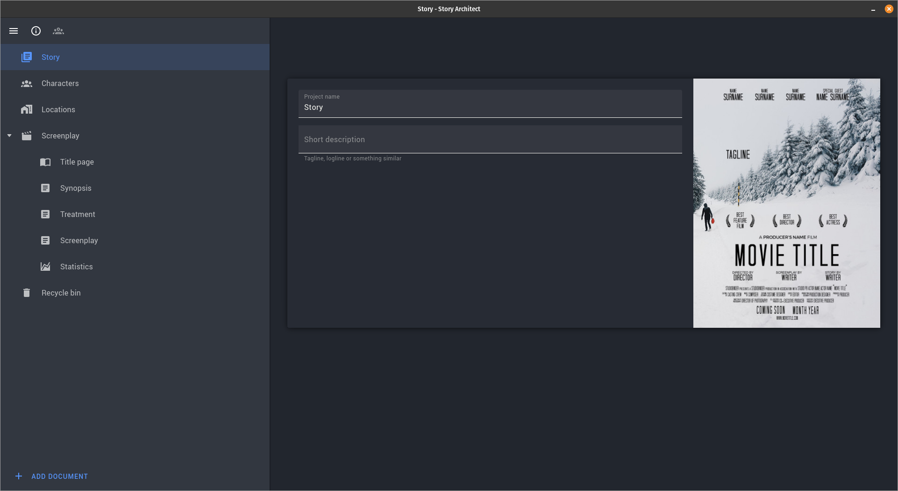

<div align="center">


# Story Architect

### Your stories. Your way.

**A professional writing environment for screenplays, novels, stage plays, audio plays, comic books, and more.**

[](./LICENSE)
[](https://github.com/story-apps/starc/actions/workflows/build_starc_windows.yml)
[](https://github.com/story-apps/starc/actions/workflows/build_starc_linux.yml)
[](https://github.com/story-apps/starc/actions/workflows/build_starc_mac.yml)

[Website](https://starc.app/) · [Download](https://starc.app/download) · [Documentation](https://starc.app/help) · [Report a bug](https://github.com/story-apps/starc/issues) · [Email support](mailto:support@starc.app) · [Translations](https://www.transifex.com/story-apps/starc/)

</div>

---

## About

**Story Architect** (STARC) is an open-source application that helps authors develop a story from the first idea to a production-ready document. It combines distraction-free writing with planning, research, character and location development, visual tools, statistics, and professional formatting.

The project is created by the team behind [KIT Scenarist](https://github.com/dimkanovikov/KITScenarist) and is built with C++ and Qt. It runs on Windows, macOS, and Linux, and lets you write in any language.

> [!NOTE]
> This repository is under active development. Features and interfaces may change between releases. For everyday use, install a packaged build from the [official download page](https://starc.app/download).

## Highlights

- **Multiple writing formats** — screenplays, TV series, novels, comic books, stage plays, audio plays, presentations, and free-form text.
- **Professional templates** — page presets for different regions and industry conventions.
- **One home for the whole story** — keep drafts, scripts, notes, research, images, characters, locations, and story worlds together.
- **Planning tools** — outlines, cards, timelines, mind maps, series plans, and screenplay breakdowns.
- **Story intelligence** — statistics, character dialogue reports, character relationships, location scenes, and other analytical views.
- **Flexible workflow** — use multiple documents and multiple drafts inside a single project.
- **Import and export** — exchange work with popular screenwriting and office formats, including Final Draft, Fountain, DOCX, ODT, PDF, Celtx, Trelby, and KIT Scenarist formats (availability varies by document type and direction).
- **International interface** — dozens of UI translations and support for both left-to-right and right-to-left writing systems.
- **Cross-platform desktop app** — native packages for Windows, macOS, and Linux.

<p align="center">
  
</p>

## Get Story Architect

The easiest way to start is to download an official build:

| Platform | Package |
|:--|:--|
| Windows | Installer and portable archive |
| macOS | DMG image |
| Linux | AppImage |

Visit **[starc.app/download](https://starc.app/download)** for the latest stable and development versions.

## Build from source

### Prerequisites

The application is built with **C++17**, **Qt**, and **qmake**. CI currently exercises both Qt 5 and Qt 6 builds.

You will need:

- Git;
- a C++17-compatible compiler;
- Qt 5 or Qt 6 with qmake, including Core, GUI, Widgets, Concurrent, Multimedia, Network, SQL, and XML; some bundled components also use Qt GUI/Widgets private headers;
- when using Qt 6, the Qt 5 Core Compatibility module (the official CI setup also installs Speech and WebSockets);
- CMake, GNU Make, and pkg-config on Linux/macOS;
- Python and the platform build tools required by Chromium's `depot_tools` (the Crashpad script downloads these tools and sources);
- OpenSSL and zlib development files.

On Ubuntu/Debian, the native packages used by CI can be installed with:

```bash
sudo apt update
sudo apt install \
  cmake make pkg-config libx11-dev xcb libx11-xcb-dev \
  libxkbcommon-x11-0 libxkbcommon-dev libgtk-3-dev \
  libgstreamer-plugins-base1.0-0 libcurl4-openssl-dev \
  zlib1g-dev libxcb-cursor0
```

### 1. Clone the repository

```bash
git clone https://github.com/story-apps/starc.git
cd starc
```

Initialize the public PDF dependencies used by the community build:

```bash
git submodule update --init --recursive \
  src/3rd_party/pdfhummus \
  src/3rd_party/pdftextextraction
```

> [!IMPORTANT]
> The repository also references private cloud and commercial-feature submodules. A plain `git submodule update --init --recursive` may therefore request access you do not have. The command above fetches only the dependencies needed by public pull-request builds.

### 2. Build Crashpad

From the repository root:

```bash
cd build
chmod +x build_crashpad.sh
./build_crashpad.sh
cd ..
```

Useful options:

| Option | Description |
|:--|:--|
| `-d` | Build Crashpad in debug mode |
| `-a ARCH`, `--arch ARCH` | Select `x86`, `x64`, or `arm64` |
| `-u`, `--universal` | Build a universal x64 + arm64 binary on macOS |

For example, use `./build_crashpad.sh -a x64` for a 64-bit Windows build or `./build_crashpad.sh -u` for a universal macOS build.

### 3. Build the application

```bash
cd src
qmake starc.pro CONFIG+=release
make -j"$(nproc)"
```

On macOS, replace `$(nproc)` with a suitable number such as `4`. On Windows, run qmake from the matching Qt/MSVC developer environment and use `nmake`:

```powershell
cd src
qmake starc.pro CONFIG+=release CRASHPAD_ARCH=x64
nmake
```

Build products are written to `src/_build/`; the main executable is named `starcapp` (`starcapp.exe` on Windows).

### Debug build

Crashpad and the application should use the same configuration:

```bash
cd build
./build_crashpad.sh -d
cd ../src
qmake starc.pro CONFIG+=debug
make -j"$(nproc)"
```

## Project structure

```text
starc/
├── build/                  Packaging scripts and Crashpad builder
├── img/                    README artwork
└── src/
    ├── 3rd_party/          Bundled and submodule dependencies
    ├── app/                Application entry point
    ├── core/               Main application and feature UI
    ├── corelib/            Domain, data, business, and shared UI layers
    ├── interfaces/         Cross-module interfaces
    ├── testapp/            Internal test application
    └── starc.pro           Top-level qmake project
```

The top-level qmake project builds dependencies first, followed by the application libraries, plugins, and executable.

## Contributing

Contributions are welcome. A good workflow is:

> [!IMPORTANT]
> Story Architect has an established product vision and development roadmap. We appreciate every contribution, but cannot guarantee that changes which do not align with that direction will be accepted. Before investing significant time in a new feature or a substantial architectural change, please open an issue to discuss the proposal with the maintainers.

1. Search [existing issues](https://github.com/story-apps/starc/issues) before opening a new one.
2. Fork the repository and create a focused branch.
3. Keep changes small and follow the existing C++/Qt style.
4. Format C/C++ changes with the repository's `src/.clang-format` configuration.
5. Build the application locally and describe the checks you performed.
6. Open a pull request with a clear motivation and, for UI changes, screenshots.

Please do not include unrelated formatting or generated build files in a pull request.

## Localization

Want to use Story Architect in your language or improve an existing translation? Join the project on [Transifex](https://www.transifex.com/story-apps/starc/) and see the [translation guide](https://github.com/story-apps/starc/wiki/How-to-add-the-translation-of-Story-Architect-to-your-native-language-or-improve-the-existing-version%3F).

## Feedback and bug reports

Found a bug, have a question, or want to share feedback? Open an issue in the [GitHub issue tracker](https://github.com/story-apps/starc/issues) or email us at **[support@starc.app](mailto:support@starc.app)**.

## Support the project

You can support continued development by:

- starring the repository;
- reporting reproducible bugs and suggesting improvements;
- contributing code or translations;
- sharing Story Architect with other writers;
- exploring the [premium plans](https://starc.app/pricing).

Product news and release notes are published on the [Story Architect blog](https://starc.app/blog/).

## License

Story Architect is distributed under the **GNU General Public License v3.0**. See [LICENSE](./LICENSE) for the complete terms.

Third-party components and optional modules may have their own license terms.

---

<div align="center">

**Thank you for using Story Architect — have fun creating!**

</div>
